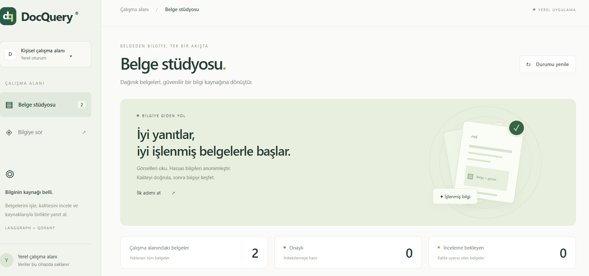
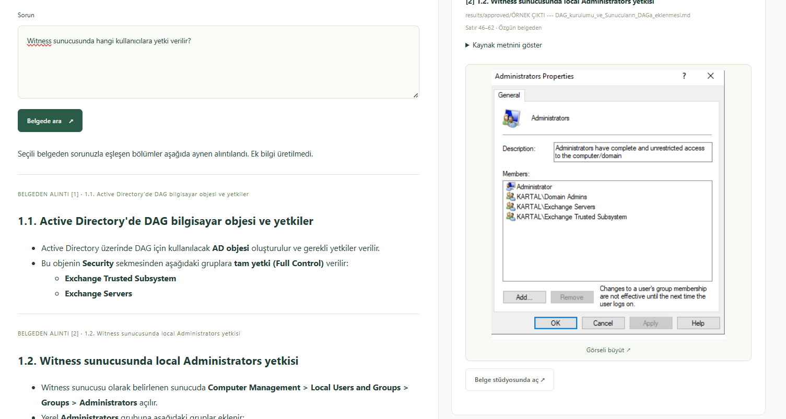
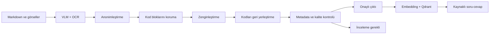
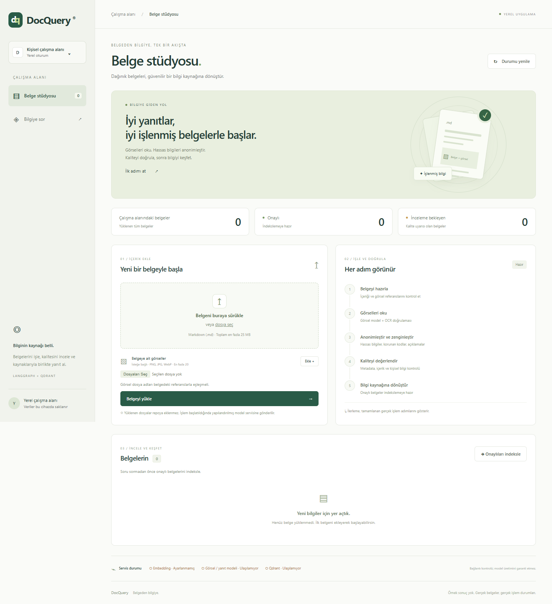
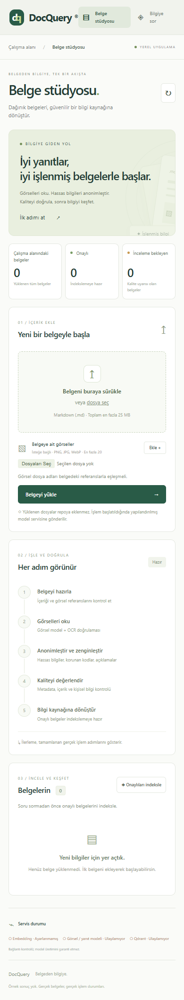

# DocQuery

**Teknik belgeleri işle, kalitesini kontrol et ve kaynaklarıyla birlikte sorgula.**

DocQuery, Exchange Server belgelerini ve ekran görüntülerini işleyen Python tabanlı bir uygulamadır. LangGraph belge işleme akışını yönetir; Qwen/VLM ve OCR görsellerin okunmasını, Qdrant ise onaylı belgeler üzerinden kaynaklı soru-cevap akışını sağlar.

## Belge stüdyosu

Markdown belgeni ve ilişkili görselleri yükle, işlemi başlat ve ilerlemeyi takip et. Tamamlanan belgenin kalite uyarılarını incele, çıktıyı önizle veya Markdown olarak indir.



- **Belge ve görsel yükleme:** UTF-8 Markdown, PNG, JPG ve WebP desteği.
- **Belge işleme:** Görsel okuma, OCR doğrulaması, anonimleştirme ve zenginleştirme.
- **Kalite kontrolü:** Eksik açıklama, OCR güveni ve kişisel bilgi kontrolleri.
- **İşlem takibi:** Gerçek LangGraph adımları, tamamlanma ve hata durumları.
- **Sonuç inceleme:** Metadata, Markdown önizleme ve dosya indirme.

## Kaynaklı soru-cevap

Kalite kontrolünden geçen belgeleri **Onaylıları indeksle** ile Qdrant'a aktar. Ardından **Bilgiye sor** ekranında sorunu yaz. İlgili belge parçaları modele bağlam olarak gönderilir; yanıtla birlikte kaynak metinleri, dosya adları ve parça numaraları gösterilir.



*Bu görüntü önceki yerel alıntı prototipine aittir. Güncel soru-cevap akışı Qdrant, embedding servisi ve Qwen/VLM kullanır; görseldeki yanıt bir model çıktısı değildir.*

Kaynak bulunamadığında veya bir servise ulaşılamadığında durum ekranda belirtilir. Hazır belge önizlemesi, belgenin otomatik olarak indekslendiği anlamına gelmez.

## Kurulum

**Gereksinimler:** Python 3.11+, Qdrant, OpenAI uyumlu bir görsel/sohbet modeli servisi ve ayrı bir embedding servisi. Görsel doğrulaması için OCR kurulumu gerekir.

Arayüz Flask, HTML, CSS ve JavaScript kullanır. Node.js veya frontend derlemesi gerekmez.

Proje kökünde, Windows PowerShell ile:

```powershell
python -m venv .venv
.venv\Scripts\python -m pip install -r requirements-web.txt

# Yalnızca .env dosyası henüz yoksa:
Copy-Item .env.example .env
```

Linux/macOS'ta `.venv\Scripts\python` yerine `.venv/bin/python` kullanın.

### Servis ayarları

`.env` dosyasını çalışan servislerinize göre düzenleyin:

| Ayar | Açıklama |
| --- | --- |
| `VLLM_URL` | Görsel/sohbet modelinin `/v1/chat/completions` adresi |
| `VLLM_MODEL` | Serviste yüklü Qwen/VLM modelinin adı |
| `EMBEDDING_URL` | Embedding servisinin `/v1/embeddings` adresi |
| `EMBEDDING_MODEL` | Türkçe destekli embedding modelinin adı |
| `QDRANT_URL` | Qdrant adresi; varsayılan `http://localhost:6333` |

Gerekiyorsa `VLLM_API_KEY`, `EMBEDDING_API_KEY` ve `QDRANT_API_KEY` alanlarını doldurun. Model servisleri ayrıca başlatılmalıdır; `.env` ayarları bu servisleri kurmaz.

Docker kurulu ve çalışır durumdayken Qdrant'ı başlatın:

```powershell
docker compose up -d qdrant
```

OCR için sisteminizde **Tesseract ve tur/eng dil paketlerini** kurun. Python OCR paketleri dahil tam belge işleme bağımlılıkları `requirements.txt` dosyasındadır:

```powershell
.venv\Scripts\python -m pip install -r requirements.txt
```

### Uygulamayı çalıştırma

```powershell
.venv\Scripts\python web.py
```

Tarayıcıda **http://127.0.0.1:8080** adresini açın. Başka bir port kullanmak için:

```powershell
$env:DOCQUERY_PORT="8081"
.venv\Scripts\python web.py
```

`.env` değişikliklerinden sonra uygulamayı yeniden başlatın. Arayüz servisler kapalıyken de açılır; belge işleme ve soru-cevap için ilgili servislerin çalışması gerekir.

## Kullanım

1. **Belgeyi yükle:** `.md` dosyasını ve ilişkili görselleri seçin. Görsel adları Markdown referanslarıyla eşleşmelidir: `images/ekran.png` → `ekran.png`.
2. **İşlemi başlat:** Belge satırından akışı başlatıp tamamlanan adımları takip edin.
3. **Sonucu incele:** Kalite uyarılarını kontrol edin; çıktıyı önizleyin veya indirin.
4. **Onaylıları indeksle:** QA onaylı web belgelerini Qdrant'a aktarın.
5. **Bilgiye sor:** Sorunuzu gönderin ve yanıtın dayandığı kaynakları inceleyin.

Yükleme sınırı toplam **25 MB ve 20 görseldir**. PDF/DOCX dönüşümü desteklenmez. İnceleme gerektiren belgeler indekslenmez; kaynağı düzeltip yeniden yükleyin.

Yerel DAG ve Exchange HealthCheck dosyaları mevcutsa **Önceden üretilmiş sonuçlar** panelinden metinleri, metadata alanları ve ilişkili görselleri açılabilir. Bu panel yeni OCR/AI işlemi başlatmaz. Örnek belgeler ve kaynak görseller repoya dahil değildir.

## İşleme akışı



Web yüklemeleri ayrı süreçlerde, sırayla işlenir. Başarısız işlemler hata olarak gösterilir; OCR bulunmaması doğrulama başarısı sayılmaz.

## Komut satırı

Web arayüzüne ek olarak mevcut toplu işleme ve RAG komutları kullanılabilir:

```powershell
# Belgeler: test_input/ — Görseller: test-images/
.venv\Scripts\python run_batch.py
.venv\Scripts\python check_outputs.py

# results/approved/ belgelerini indeksle ve sorgula
.venv\Scripts\python rag.py index
.venv\Scripts\python rag.py ask "DAG nasıl yapılandırılır?" --top-k 5 --json
```

Web indeksi (`WEB_QDRANT_COLLECTION`, varsayılan `docquery_web_documents`) ve CLI indeksi (`QDRANT_COLLECTION`, varsayılan `docquery_documents`) ayrıdır. Yeni indeks tamamen yüklenmeden aktif Qdrant alias'ı değiştirilmez. Belge veya embedding modeli değiştiğinde yeniden indeksleyin. Eski koleksiyonlar otomatik silinmez.

## Yerel veriler

| Konum | İçerik |
| --- | --- |
| `.web-data/` | Web yüklemeleri, işlem durumları, çıktılar ve belgeye özel sözlükler |
| `test_input/`, `test-images/` | Komut satırı giriş belgeleri ve kaynak görseller |
| `results/approved/` | Onaylı CLI çıktıları |
| `results/needs_review/` | İnceleme gerektiren CLI çıktıları |
| `anonymization_dict.json` | CLI akışının ortak anonimleştirme sözlüğü |

Bu konumlar ve `.env` Git dışında tutulur. İşleme sırasında içerik yapılandırılmış model servislerine gönderilir. Uygulama tek kullanıcılı yerel kullanım içindir; kullanıcı yönetimi ve dağıtık görev kuyruğu içermez.

## Diğer görünümler

<details>
<summary>Boş çalışma alanı ve mobil görünüm</summary>





</details>

## Geliştirme ve doğrulama

Python ve JavaScript sözdizimi kontrolleri ile 28 yerel test doğrulandı. Tarayıcıda belge önizleme, indirme, mobil görünüm ve servis hata durumları kontrol edildi. Gerçek model üretimi ve uzak Qdrant üzerinde başarılı uçtan uca akış, servisler erişilemediği için doğrulanamadı.

`tests/` ve `web_tests/` klasörleri Git dışında tutulur; yerel çalışma kopyanızda mevcutlarsa şu komutlarla çalıştırabilirsiniz:

```powershell
.venv\Scripts\python -m unittest discover -s tests -v
.venv\Scripts\python -m unittest discover -s web_tests -v
```
